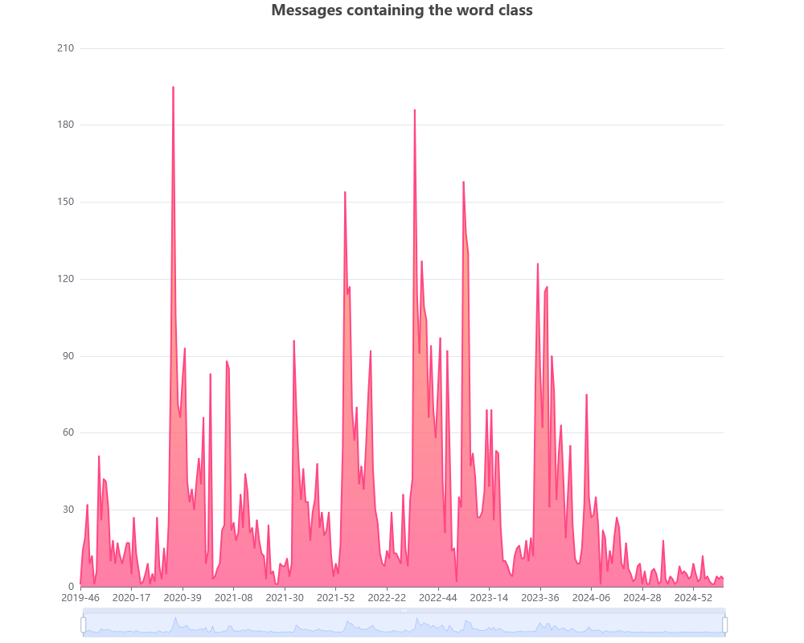

# Statcat

A work-in-progress Discord statistics generator in Rust.

Builds a cached Sqlite table using Rusqlite and Serenity for quick access 
to messages over a set period. These messages can then be queried via data views 
and graphed using Charming into beautiful data visualizations.

## Project Goals

This is mainly to act as a fun revival of one of my favorite Python projects, 
but after a few years and with much more experience under my belt. This also lets me practice 
Rust while honing my SQL query skills (weak), and try out some cool new data visualization libraries.

## Examples

After gathering the 1.5 million messages in our Discord server, I was able to visualize
the frequency of the word 'class,' showing specifically when summer breaks, winter breaks, 
and graduation occurred. Pretty cool!

